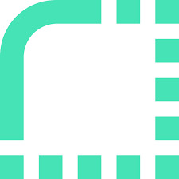

<h1 align="center">Howdy 👋, I'm Dez!</h1>
<h3 align="center">I am a full-stack developer with a passion for learning :scroll:</h3>

  

  

- 🔭 I’m currently working on [Lockbox](https://github.com/DezSays/Password_Manager)

- 👨‍💻 My most recent projects can be found on my [Portfolio](https://dezthedev.netlify.app/)

- 💬 Ask me about **JavaScript**

- :e-mail: Email me at **dezareabryan@gmail.com**

- :inbox_tray: Connect with me on [LinkedIn](https://www.linkedin.com/in/dezarea-bryan/)

<h3 align="center">Languages and Tools:</h3>

   

<h3 align="center">Connect with me:</h3>

&nbsp;

  
